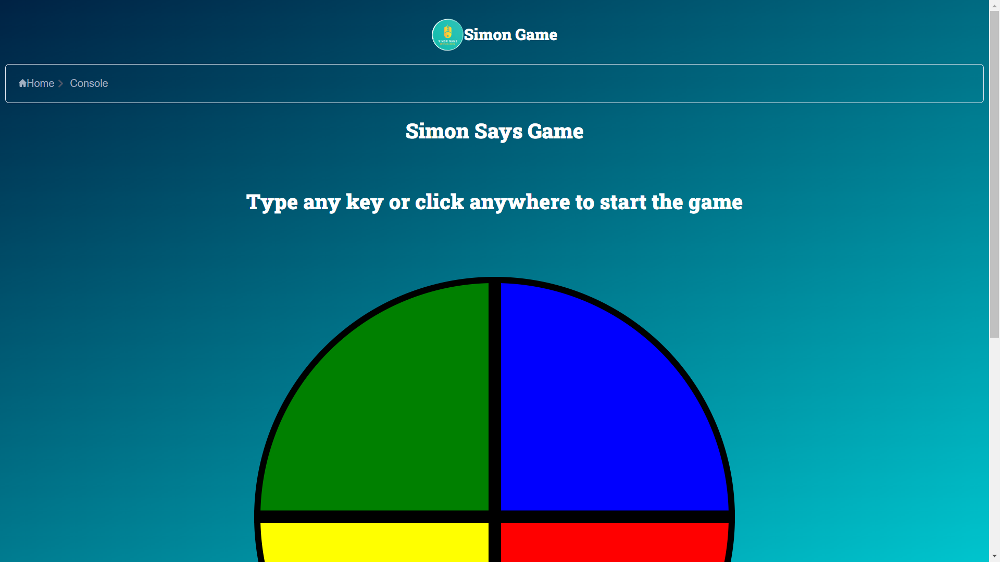

# Simon Game 




## Overview

This is a web-based implementation of the classic Simon Game. Test your memory skills by repeating the pattern of colors generated by the game. The difficulty increases as you progress through the levels.

## Demo

You can try out the game live at [Demo Link](https://simongamebyvj.netlify.app/)

## Features

- Start and Restart buttons
- Progressive difficulty levels
- Auditory and visual feedback for correct and incorrect moves
- Responsive design for optimal experience on various devices

## Technologies Used

- HTML5
- CSS3
- JavaScript 
- Tailwind CSS

## Installation

To run this project locally, follow these steps:

1. Clone the repository:

```bash
git clone https://github.com/Vishesh-04/Simon-Game
```

2. Open the `index.html` file in your web browser.

## How to Play

1. Type any key or click anywhere on the screen to initiate the game.
2. Repeat the pattern of colors played by Simon.
3. Have fun and test your memory skills!

## Contributing

If you'd like to contribute to this project, please follow these guidelines:

1. Fork the repository
2. Create a new branch: `git checkout -b feature-name`
3. Commit your changes: `git commit -m 'Add new feature'`
4. Push to the branch: `git push origin feature-name`
5. Submit a pull request

## License

This project is licensed under the [MIT License](LICENSE).

## Acknowledgements

- Inspired by the classic Simon Game
- [https://tailwindcss.com/]

## Contact

If you have any questions or suggestions, feel free to contact us at [LinkedIn](https://www.linkedin.com/in/vishesh-jindal/).
